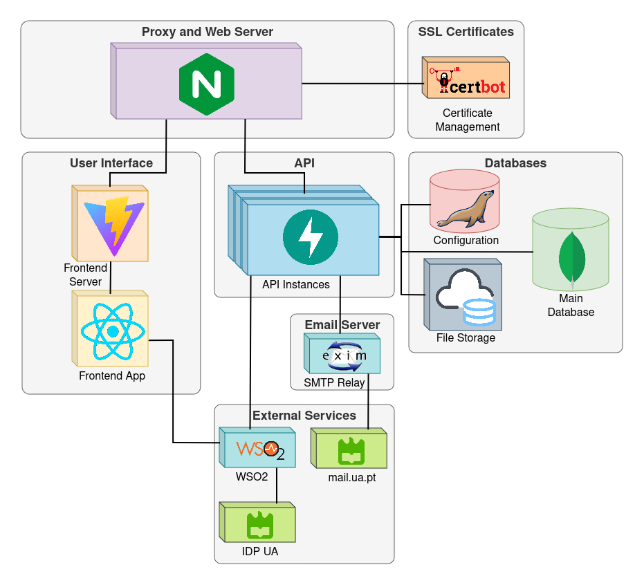

# PI-Project in Informatics

## Academic Year: 2023/24

### **Grade: 20** 

## Team ✨

<!-- ALL-CONTRIBUTORS-LIST:START -->
<!-- prettier-ignore-start -->
<!-- markdownlint-disable -->
<table>
  <tr>

<td align="center" width="50px;"></td>
    <td align="center"><a href="https://github.com/P-Ramos16"> <b>Pedro Ramos</b> <i>107348</i></a>
<b>Backend</b> <a href="https://github.com/P-Ramos16" title="Code">💻</a> <a href="https://github.com/P-Ramos16" title="Tests">⚠️</a> <a href="https://github.com/P-Ramos16" title="Tools">🔨</a></td>
    <td align="center"><a href="https://github.com/FiNeX96"> <b>Rodrigo Aguiar</b> <i>108969</i></a>
<b>Backend</b> <a href="https://github.com/FiNeX96" title="Code">💻</a><a href="https://github.com/FiNeX96" title="Tools">🔀</a><a href="https://github.com/FiNeX96" title="Tools">🔨</a></td>
    <td align="center"><a href="https://github.com/Dan1m4D"> <b>Daniel Madureira</b> <i>107603</i></a>
<b>Frontend</b> <a href="https://github.com/Dan1m4D" title="Code">💻</a><a href="https://github.com/Dan1m4D" title="Design">🎨</a><a href="https://github.com/Dan1m4D" title="Tools">🔧</a></td>
    <td align="center"><a href="https://github.com/zegameiro"> <b>José Gameiro</b> <i>108840</i></a>
<b>Frontend</b> <a href="https://github.com/zegameiro" title="Code">💻</a><a href="https://github.com/zegameiro" title="Blogposts">📝</a><a href="https://github.com/zegameiro" title="Tools">🔧</a></td>
    <td align="center"><a href="https://github.com/jnluis"> <b>João Luis</b> <i>107403</i></a>
<b>Frontend</b> <a href="https://github.com/jnluis" title="Code">💻</a><a href="https://github.com/jnluis" title="Tools">🎯</a><a href="https://github.com/jnluis" title="Tools">🔧</a></td>
<td align="center" width="50px;"></td>
</tr>
</table>

<!-- markdownlint-enable -->
<!-- prettier-ignore-end -->

<!-- ALL-CONTRIBUTORS-LIST:END -->

---

## Description

 - Our project was developed to enhance the managing of the dissertation season within the Department of Electronics, Telecommunications and Informatics (DETI), at University of Aveiro, at the invite of professor [@Diogo Gomes](https://github.com/dgomes);

 - You can visit it [here](https://dissertacoes.av.it.pt), although only people from the university are able to use it directly;

 - You can check our microsite for documentation and everything about this project [here](https://pi-dsd.github.io/microsite/). This website contains all presentations for the different Milestones during the semester, the Techical report and also a demo for the developed platform.

---

## Architecture Diagram

    

---

## Deployment Diagram

    

